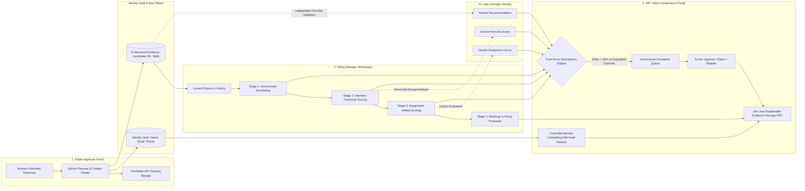

# 🛡️ FairHire AI — Responsible AI Recruitment Micro-SaaS

> **Transparent, Explainable, and Auditable Recruitment with Human Accountability.**

[](https://nextjs.org/)
[](https://www.typescriptlang.org/)
[](https://tailwindcss.com/)
[](https://aistudio.google.com/)
[](https://vercel.com/)

---

## 📌 Problem Statement & Objective

Traditional recruitment often relies on fragmented documents, subjective evaluator preferences, and unaccountable overrides where identity, pedigree, or demographic assumptions may influence outcomes.

**FairHire AI** creates a responsible recruitment workflow where:
1. **Candidates are evaluated strictly against locked, job-related criteria using professional evidence** — not personal identity, favoritism, or personal preference.
2. **AI serves strictly as an independent validator, discrepancy detector, and audit assistant** — human Hiring Managers award official marks, and HR/Admin maintains final approval authority.
3. **Every consequential action, rubric change, unmasking event, and score override is permanently recorded in a tamper-evident audit ledger.**

---

## 🏛️ 3-Persona Architecture



---

## 🌟 Key Features

### 1. 🌐 Public Applicant Portal (`/`)
* **Account-Free Application**: Public access to open requisitions with required skills, locked evaluation weights, and deadlines.
* **Identity Vault Isolation**: Contact information (Name, Email, Phone, Location) is securely separated and hidden from evaluators.
* **Traceable Candidate Code Receipt**: Generates a neutral tracking ID (e.g. `Candidate #1001`) and initial status (*"Application Received / Under Review"*).
* **Self-Service Status Tracker**: Candidates can query their current review stage using their Candidate Code.

### 2. 👔 Hiring Manager Workspace
* **Locked Rubric Criteria**: Define custom criteria weights with a **tamper-evident version history** logging every adjustment.
* **Stage 1 — Preliminary Shortlisting**: Anonymized candidate review, Rule Score vs. Gemini Recommendation (`Advance`, `Hold`, `Not Advance`), and official HM confirmation/override with mandatory reasoning.
* **Stage 2 — Round 1 Structured Interview**: Enter official criterion marks (0-100) on interview transcripts; Gemini independently scores the transcript and quotes exact excerpts as evidence.
* **Stage 3 — Round 2 Assignment**: Evaluate submitted coding/case study artifacts with dual AI validation.
* **Stage 4 — Rankings & Proposal**: Descending candidate rankings computed from locked round weights; submit official hiring recommendations (`Selected`, `Waitlisted`, `Not Selected`).

### 3. 🛡️ HR / Admin Governance Portal
* **Automated Escalation Queue**: Catches score divergences $>25\%$, unvetted overrides, adverse decisions on top candidates, and essential requirement bypasses.
* **Identity Vault & Controlled Unmasking**: Reveals contact details only when necessary (*Interview Scheduling*, *Offer Drafting*, *Legal Audit*) with a mandatory written justification and immutable audit log.
* **Immutable Audit Ledger**: Chronological event timeline documenting all rubric modifications, unmasking events, escalation resolutions, and hiring decisions.
* **Job-Level Audit Evidence Package (PDF)**: One-click export of an explainable, multi-candidate audit report with comparative matrices, discrepancy logs, and HR compliance sign-off.
* **Email Safe Mode**: Intercepts all stage-wise candidate notices into an internal testing inbox during validation.

---

## ⚖️ Dual-Score Discrepancy Classification

| Discrepancy Level | Delta ($\Delta = \|HM - AI\|$) | Action Required |
| :--- | :--- | :--- |
| 🟢 **Aligned** | $\Delta \le 10\%$ | Auto-advances to next review step. |
| 🟡 **Minor Difference** | $11\% \le \Delta \le 25\%$ | Prompts Hiring Manager for a brief clarifying note. |
| 🔴 **Significant Discrepancy** | $\Delta > 25\%$ | Requires explicit HM justification or auto-escalates to HR/Admin queue. |

---

## 🛠️ Technology Stack

* **Framework**: Next.js 15 (App Router, Server Components & Route Handlers)
* **Language**: TypeScript 5.7
* **Styling**: Tailwind CSS & Modern Dark-Mode Design System
* **AI Engine**: Google Gemini 1.5 Flash via `@google/genai` & REST Route Handlers
* **PDF Engine**: `jspdf` for client-side job governance evidence packages
* **Icons**: `lucide-react`
* **Deployment**: Vercel (Serverless Edge & Route Handlers)

---

## 🚀 Getting Started Locally

### 1. Clone the repository
```bash
git clone https://github.com/nithishkumar2032-debug/FairHire-AI.git
cd FairHire-AI
```

### 2. Install dependencies
```bash
npm install
```

### 3. Configure environment variables
Create a `.env.local` file in the project root:
```env
GEMINI_API_KEY=your_google_gemini_api_key_here
```
*(You can obtain an API key from [Google AI Studio](https://aistudio.google.com/app/apikey).)*

### 4. Run the development server
```bash
npm run dev
```

Open [http://localhost:3000](http://localhost:3000) (or `http://localhost:3001` if port 3000 is occupied) in your browser.

---

## ☁️ Deploying to Vercel (Production URL)

1. Import your GitHub repository (`FairHire-AI`) into [Vercel](https://vercel.com/new).
2. Add your environment variable:
   * `GEMINI_API_KEY`: `your_gemini_api_key`
3. Click **Deploy**. Vercel will automatically build and publish your live production application.

---

## 📜 Ethical Principles & Responsible AI Boundaries

* **AI is a validator, not a decision-maker**: Authorized humans make all employment decisions.
* **Zero Demographic Bias**: No inferencing of personality, emotion, accent, appearance, gender, or age.
* **Provider failure never equals rejection**: Empty outputs or quota throttles never result in zero scores or candidate rejection.
* **Auditable at every step**: Every score, override, and unmasking event remains verifiable in the immutable audit trail.

---

## 📄 License
This project is licensed under the MIT License.
